# LLM Guide to Generating Mermaid Gantt Charts

A comprehensive reference for generating accurate, well-structured Mermaid Gantt charts compatible with this editor's parser.

## Basic Structure

Every Mermaid Gantt chart starts with the `gantt` declaration followed by configuration and tasks:

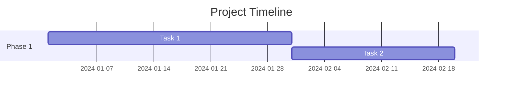

## Configuration Options

### Date Formats

Always specify a `dateFormat`. Supported formats:

| Format | Example | Notes |
|--------|---------|-------|
| `YYYY-MM-DD` | 2024-01-15 | **Recommended** - ISO standard |
| `DD/MM/YYYY` | 15/01/2024 | European format |

**Important:** The parser matches format length exactly, so dates must have the same character count as the format string.

### Axis Format

Controls how dates display on the chart axis:

```mermaid
gantt
    title Project Plan
    dateFormat YYYY-MM-DD
    axisFormat %b %d
```

**Common `axisFormat` patterns:**
- `%Y-%m-%d` — Full date (2024-01-15)
- `%b %d` — Month abbrev + day (Jan 15)
- `%d %b` — Day + month abbrev (15 Jan)
- `%B %Y` — Full month + year (January 2024)

### Excluding Days

```mermaid
gantt
    excludes weekends
    excludes 2024-12-25, 2024-01-01
```

Multiple values are comma-separated.

## Task Syntax

### Complete Task Format

```
Task name :status, alias, start, duration
```

The order is fixed: **status** (optional), **alias** (optional), **start** (required), **duration** (required).

### Task Statuses

| Status | Keyword | Rendering |
|--------|---------|-----------|
| Default | (omit) | Normal bar |
| Active | `active` | Highlighted/bold |
| Done | `done` | Grayed out |
| Critical | `crit` | Red/highlighted |
| Milestone | `milestone` | Diamond marker |

**Note:** Unlike standard Mermaid, this parser does NOT support combined statuses (e.g., `done, crit`). Use only one status per task.

### Examples with Status

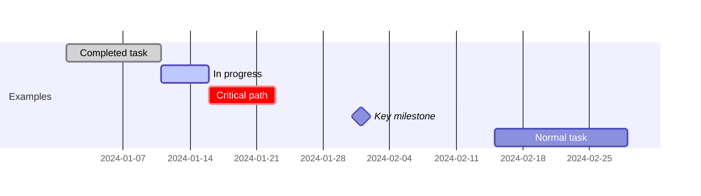

### Start Date Options

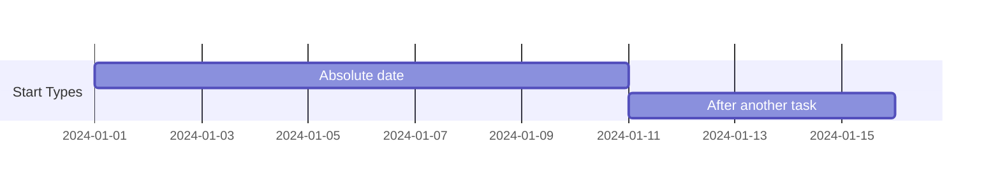

**Important:** Only single dependencies are supported. `after t1 t2` (multiple dependencies) is NOT parsed correctly.

### Duration Units

| Unit | Suffix | Example |
|------|--------|---------|
| Days | `d` | `10d` |
| Weeks | `w` | `2w` (= 14 days) |
| Hours | `h` | `48h` (= 2 days) |

You can also specify an absolute end date instead of duration:

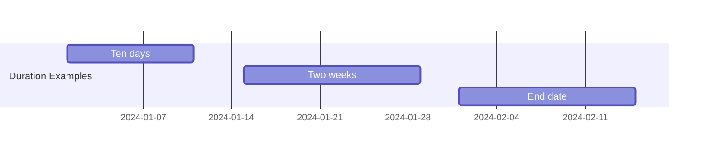

**Note:** Minutes (`m`) are NOT supported by this parser.

## Sections

Sections group related tasks visually:

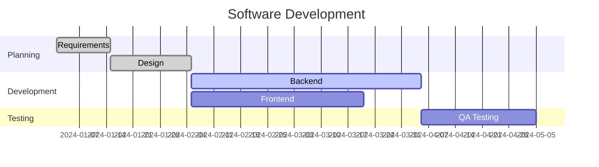

Tasks without a preceding `section` declaration will be grouped under "Uncategorized" on export.

## Milestones

Milestones are zero-duration markers. Use either:

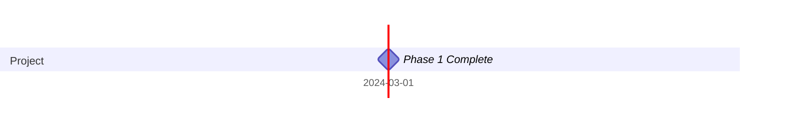

The `milestone` status with `0d` duration creates a diamond marker.

## Dependencies

### Single Dependency

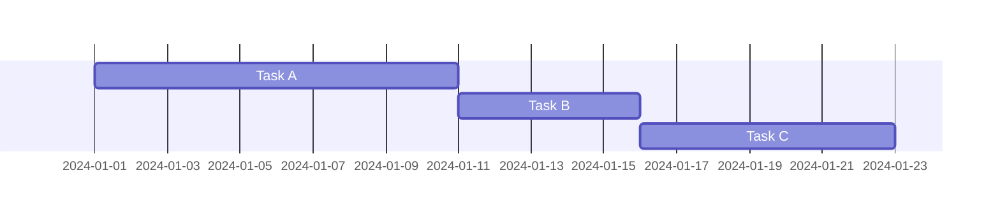

Dependencies create a chain where each task starts after its predecessor ends (plus 1 day).

**Limitation:** Multiple dependencies (`after a b`) are NOT supported by this parser. Each task can only depend on one other task.

## Data Model Reference

The parser converts Mermaid syntax into this data structure:

```typescript
interface GanttData {
    config: {
        title: string;
        dateFormat: string;      // e.g., 'YYYY-MM-DD'
        axisFormat: string;      // e.g., '%Y-%m-%d'
        excludes: string[];      // e.g., ['weekends', '2024-01-15']
    };
    sections: Array<{
        id: string;
        name: string;
        order: number;
    }>;
    tasks: Array<{
        id: string;
        title: string;
        sectionId: string | null;
        startDate: Date;
        endDate: Date;
        status: 'active' | 'done' | 'crit' | 'milestone' | null;
        dependencies: string[];  // task IDs
        isMilestone: boolean;
        // ... additional fields for UI (color, tags, notes, etc.)
    }>;
}
```

## Common Patterns

### Project Timeline Template

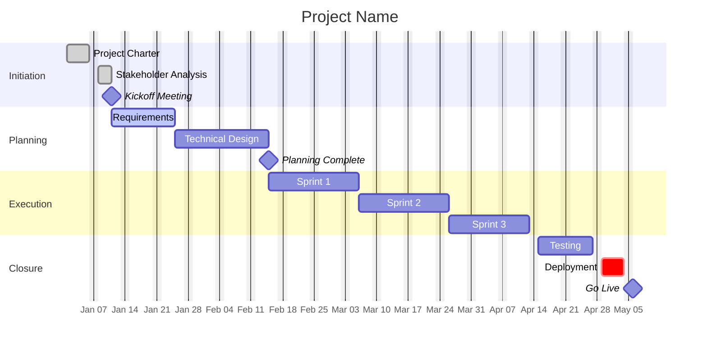

### Sprint Planning Template

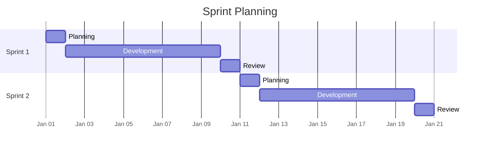

### Parallel Workstreams

Since multiple dependencies aren't supported, model parallel work with explicit dates:

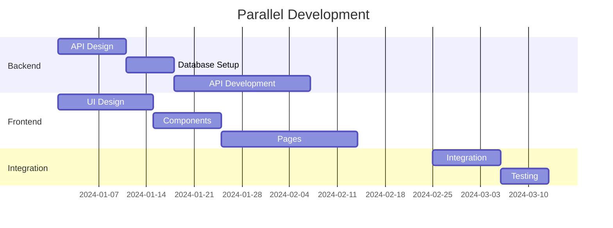

## Critical Rules for Accurate Generation

### 1. Always Include Required Elements

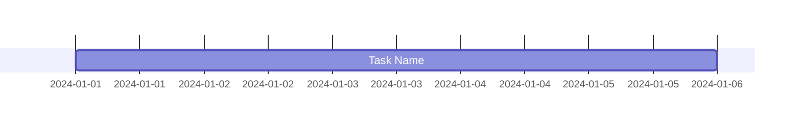

Minimum required: `gantt`, `dateFormat`, and at least one task.

### 2. Task Aliases Must Be Unique

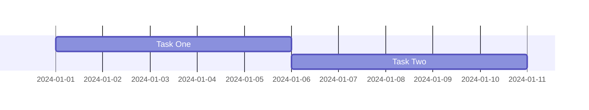

Each alias is used to reference tasks in dependencies.

### 3. No Circular Dependencies

The parser validates for circular dependencies and will error if detected.

**Invalid:**
```
Task A :a, after b, 5d
Task B :b, after a, 5d   ← Circular!
```

### 4. Status Comes Before Alias

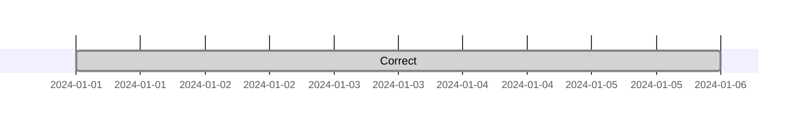

**Invalid:**
```
Wrong :t1, done, 2024-01-01, 5d   ← Status after alias
```

### 5. Dates Must Match Format Exactly

If `dateFormat YYYY-MM-DD` is set, dates must be exactly 10 characters: `2024-01-15`

**Invalid with `YYYY-MM-DD` format:**
```
Task :t1, 24-01-15, 5d        ← Wrong year format
Task :t2, 2024-1-15, 5d       ← Missing leading zero
Task :t3, January 15 2024, 5d ← Wrong format entirely
```

### 6. Sections Cannot Be Empty Names

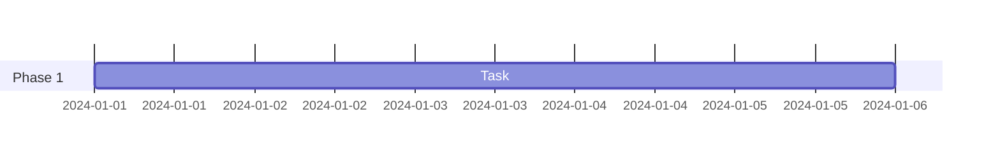

### 7. End Date Must Be After Start Date

The parser validates that `endDate >= startDate` for all tasks.

## Export Format

When exporting from this editor, the Mermaid output follows this structure:

```mermaid
gantt
    title [title if set]
    dateFormat YYYY-MM-DD
    axisFormat [if not default]
    excludes [if any]

    section [Section Name]
    [Task] :[status], [auto-alias], [start/after], [duration]d
```

Auto-generated aliases use the first 3 characters of the task name plus a counter (e.g., `tas1`, `dev2`).

## Error Prevention Checklist

Before outputting a Gantt chart, verify:

- [ ] `gantt` declaration is first line
- [ ] `dateFormat` is specified
- [ ] All task aliases are unique
- [ ] No circular dependencies exist
- [ ] Dependencies reference existing task aliases
- [ ] Durations use valid units (`d`, `w`, `h`)
- [ ] Only ONE dependency per task (no `after a b`)
- [ ] Only ONE status per task (no `done, crit`)
- [ ] Milestones have `0d` duration
- [ ] Sections have non-empty names
- [ ] Status comes before alias in task definition
- [ ] Dates match the specified `dateFormat` exactly

## Quick Reference Card

```
gantt
    title Chart Title
    dateFormat YYYY-MM-DD
    axisFormat %b %d
    excludes weekends
    excludes 2024-12-25

    section Section Name
    Task Name :status, alias, start, duration

    Statuses:   done | active | crit | milestone | (omit for default)
    Start:      YYYY-MM-DD | after alias
    Duration:   Nd | Nw | Nh | YYYY-MM-DD (end date)
```

## Complete Example

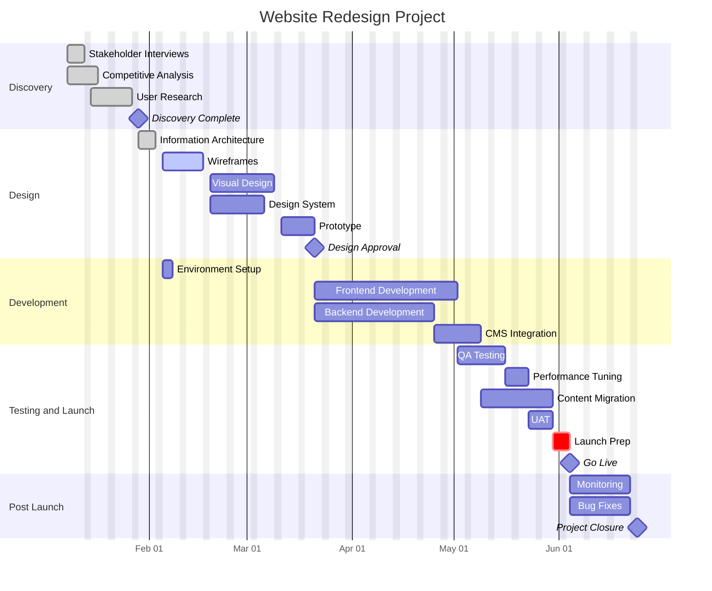

---

*This guide is tailored for the Mermaid Gantt parser in this project. Some standard Mermaid features (combined statuses, multiple dependencies, minute durations, tickInterval) are not supported.*
